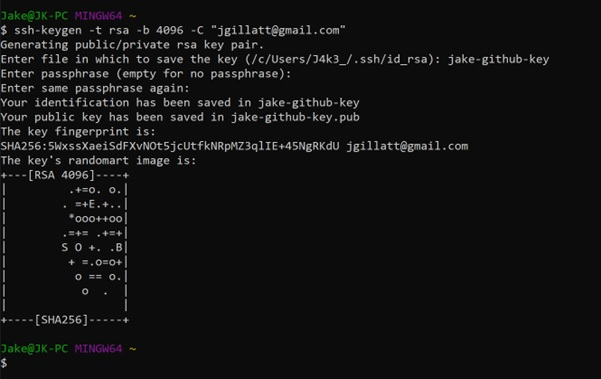

# Using SSH with git bash and GitHub

First, navigate to your Home directory by entering 'cd', and create the .ssh folder using 'mkdir .ssh'.
Use cd .ssh to enter the .ssh folder.

Generate the public/private key pairs using the code “ssh-keygen -t rsa -b 4096 -C "your_email". You can then enter the file name you wish to save your keys into
Enter the passphrase if required, if not, leave blank and press enter.
Enter the same passphrase if required, if not, press enter again.

Git bash has now created your key pairs.

Display your public key with the code “cat ‘name’-github-key.pub”. ensure to add .pub to obtain the public key.
Once the key is displayed, copy the full key from “ssh-rsa” to the end of the email. Now head over to GitHub.

Once you are on GitHub, go into your account settings and select the ‘SSH and GPG keys’ tab on the left. Then click ‘New SSH key’ on the top right.

Now you can paste your public key into the ‘key’ section and title it with preferably the same name as the key file. Click “Add SSH key” when complete to add the key.

Now in git bash we need to register the key to the SSH agent using “eval `ssh-agent -s` and then “ssh-add jake-github-key”. Use the code “ssh -T git@github.com to test whether it has successfully authenticated.

Now in GitHub, create a new repository. 

Once the new repository is created, select the SSH button.

Back in Git bash, navigate to your github folder using the cd commands. Then create a new ssh folder. Within this folder create a new README.md file using “touch README.md”. Use LS to check the file has been created.

Use “nano README.md” to access the file within git bash. Use CTRL + S to save the file and CTRL + X to exit the file.

Use “git init” to create a git repo and then use “git add .” to add the files to the repo.

Now use “git commit -m ‘message’” to commit

Rename the branch to main with “git branch -M main”
Copy the ‘git remote add origin’ link from GitHub and enter it.
Push the files to GitHub with “git push -u origin main”

